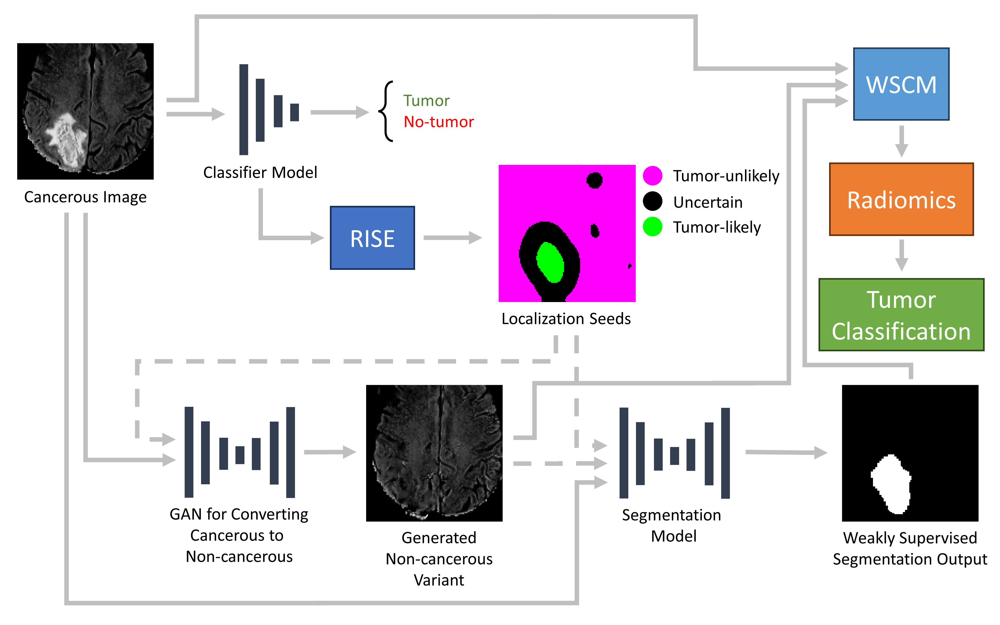

# Generative Adversarial Networks for Weakly Supervised Generation and Evaluation of Brain Tumor Segmentations on MR Images
Code for training and running weakly supervised brain tumor segmentation models and weakly supervised evaluation of segmentations using non-cancerous variants from generative models. 



Please see [Generative Adversarial Networks for Weakly Supervised Generation and Evaluation of Brain Tumor Segmentations on MR Images](https://arxiv.org/abs/2211.05269) for details.

If you use this code, please cite:
```
@misc{yoo2024generativeadversarialnetworksweakly,
      title={Generative Adversarial Networks for Weakly Supervised Generation and Evaluation of Brain Tumor Segmentations on MR Images}, 
      author={Jay J. Yoo and Khashayar Namdar and Matthias W. Wagner and Liana Nobre and Uri Tabori and Cynthia Hawkins and Birgit B. Ertl-Wagner and Farzad Khalvati},
      year={2024},
      eprint={2211.05269},
      archivePrefix={arXiv},
      primaryClass={eess.IV},
      url={https://arxiv.org/abs/2211.05269}, 
}
```

[](https://colab.research.google.com/github/JayJaewonYoo/BrainTumorWSS_GAN/blob/main/training_inference_example.ipynb) See the linked notebook for details on initializing, training, and performing inference using the models. 
